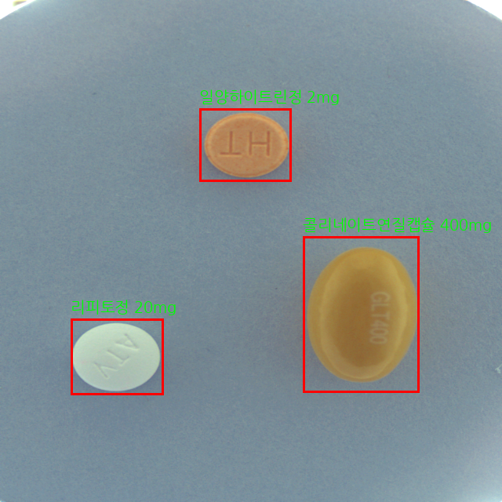

# 📌 Pill Detection with Object Detection Models

## 📖 프로젝트 개요

이 프로젝트는 다양한 배경과 각도에서 찾아내지는 정상 알약 이미지와 COCO 형식의 정보(이미지 및 바운딩 벅스)를 통해, 다음의 **총 6가지 Object Detection 모델**을 활용하여 개체 탐지 및 클래스 예측 모델을 구현하는 프로젝트입니다.

각 모델의 성능을 시험적으로 비교한 후, 가장 성능이 우수했던 **YOLOv12n** 모델을 `main` 브런치에 적용하였습니다.  
나머지 모델들은 각각 별도 브런치에 구현되어 있게 설계되어 있으며, **코드 중심으로 구성되어 문서화나 가이드는 적은 편입니다.**

### 사용한 모델 목록:

- YOLOv12n (`main` branch)
- Faster R-CNN
- RetinaNet
- Cascade R-CNN
- Deformable DETR
- SSD

---

## 📂 포른 구성

```
2025-HEALTH-VISION/
├── .github/                     # GitHub 관련 설정 파일
├── data/                        # 실제 데이터는 GitHub에 포함되지 않으며,
│   └── data.txt                 # Google Drive 내 데이터 공유 링크가 담긴 텍스트 파일만 존재
├── data_process/                # YOLO 학습용 데이터 전처리 스크립트 모음
│   ├── data_processing.py       # 고유한 카테고리 값으로 데이터 필터링 수행
│   ├── data_yaml.py             # YOLO 학습용 data.yaml 경로 설정 파일 생성
│   ├── data_main.py             # 모든 전처리 스크립트를 순차 실행
│   ├── make_labels.py           # YOLO 형식의 annotation TXT 파일 생성
│   └── move_files.py            # train/val 이미지 폴더 생성 및 분할
├── models/                      # 모델 학습, 평가 및 튜닉 스크립트
│   ├── evaluate.py              # 테스트 이미지 기반 성능 평가 (CSV 결과 생성)
│   ├── model_main.py            # 모델 관련 전체 실행 스크립트 (wandb 연동 필요)
│   ├── train.py                 # 학습 실행
│   └── tuning.py                # 하이퍼파리터 튜닉
├── notebooks/                   # Jupyter 노트북
│   └── data_preprocessing.ipynb # 데이터 전처리 코드 모음
├── src/                         # 설정 및 유틸 모듈
│   ├── __init__.py              # src 폴더 모듈화
│   └── config.py                # 프로젝트의 현재 작업 디렉토리를 main 기준으로 설정
├── main.py                      # data_main & model_main 실행
├── visualization.py             # 예측된 결과 시각화 코드
├── environment.yml              # Conda 환경 설정 파일
├── image_annotations.csv        # 전처리된 주석 CSV
├── README.md                    # 프로젝트 문서
├── image_example.png            # 예시 이미지
```

---

## 🔧 사용 방법

### 1️⃣ GitHub 저장소 클론

```bash
git clone https://github.com/your-username/2025-health-vision.git
cd 2025-health-vision
```

### 2️⃣ 라이브러리 설치

```bash
conda env create -f environment.yml
conda activate health-vision
```

### 3️⃣ 학습 코드 실행

```bash
python main.py
```

※ 이때 wandb 계정 연동이 필요할 수 있으므로 계정 정보를 미리 준비해주세요.

메인 코드를 실행하면 모델 학습 이후 테스트 폴더 이미지의 예측 결과를 CSV파일로 정리하여 저장합니다.

### 4️⃣ 시각화 코드 실행

```bash
python visualization.py --idx 62
```

원하는 테스트 이미지의 시각화 결과를 확인할 수 있습니다.

---

## 🩼 데이터 전처리 안내

AI Hub에서 데이터를 직접 다운로드한 경우 다음과 같은 전처리 과정을 거쳐야 합니다:

1. **이미지 통합 정리**
   - 다운로드된 원본 이미지들은 여러 개의 하위 폴더에 나누어 저장되어 있습니다.
   - `notebooks/data_preprocessing.ipynb` 파일에 포함된 코드를 실행해 **하나의 폴더로 통합**합니다.

2. **JSON 어노티션 수정**
   - 원본 JSON 파일은 형식 오류가 있거나 모델 학습에 맞지 않게 구성되어 있을 수 있습니다.
   - 노트북 파일 내 수정 코드를 실행해 **올바른 포맷으로 정제**합니다.

3. **손상된 이미지 제거**
   - 일부 이미지 파일은 깨져 있거나 열 수 없는 경우가 있습니다.
   - 이를 자동으로 감지하여 제거하는 코드가 노트북에 포함되어 있습니다.

4. **CSV 변환**
   - 수정된 JSON 어노티션을 COCO 형식 대신 **CSV 포맷**으로 변환하는 코드도 함께 제공됩니다.

모든 전처리 코드는 `notebooks/data_preprocessing.ipynb`에서 순차적으로 실행할 수 있습니다.

---

## 🔗 데이터 출처

- 본 프로젝트는 AI Hub에서 제공하는 공개 데이터셋을 활용하였습니다.
- 데이터셋 링크: [AI Hub - 의약품 이미지 객체 검출](https://aihub.or.kr/aihubdata/data/view.do?currMenu=115\&topMenu=100\&dataSetSn=576)

---

## 📷 예측 결과 예시

